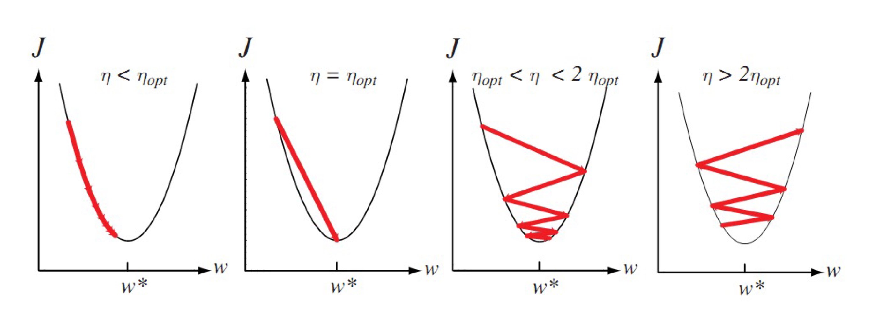
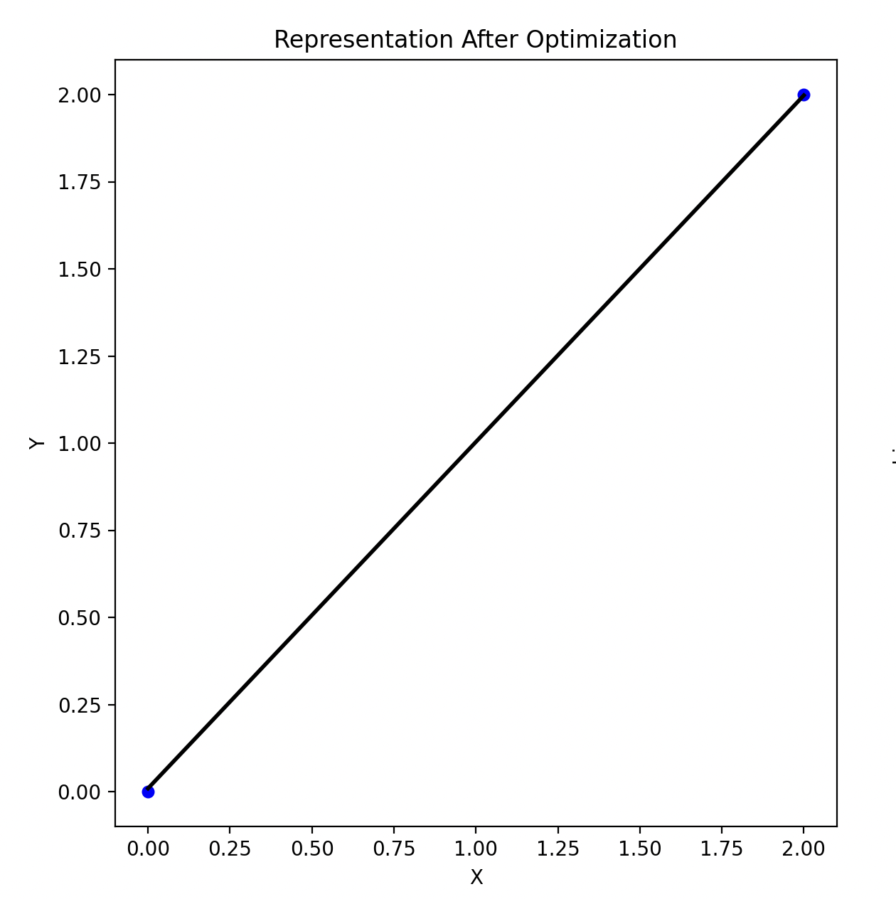
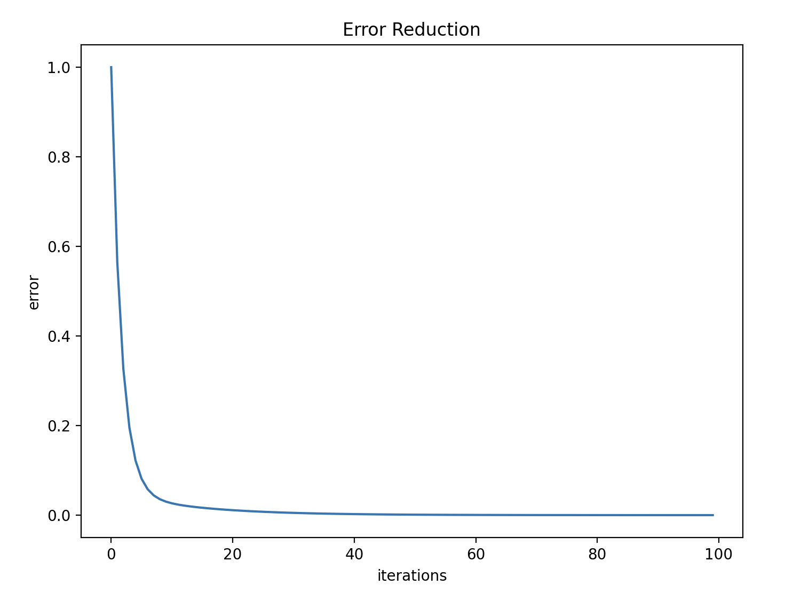
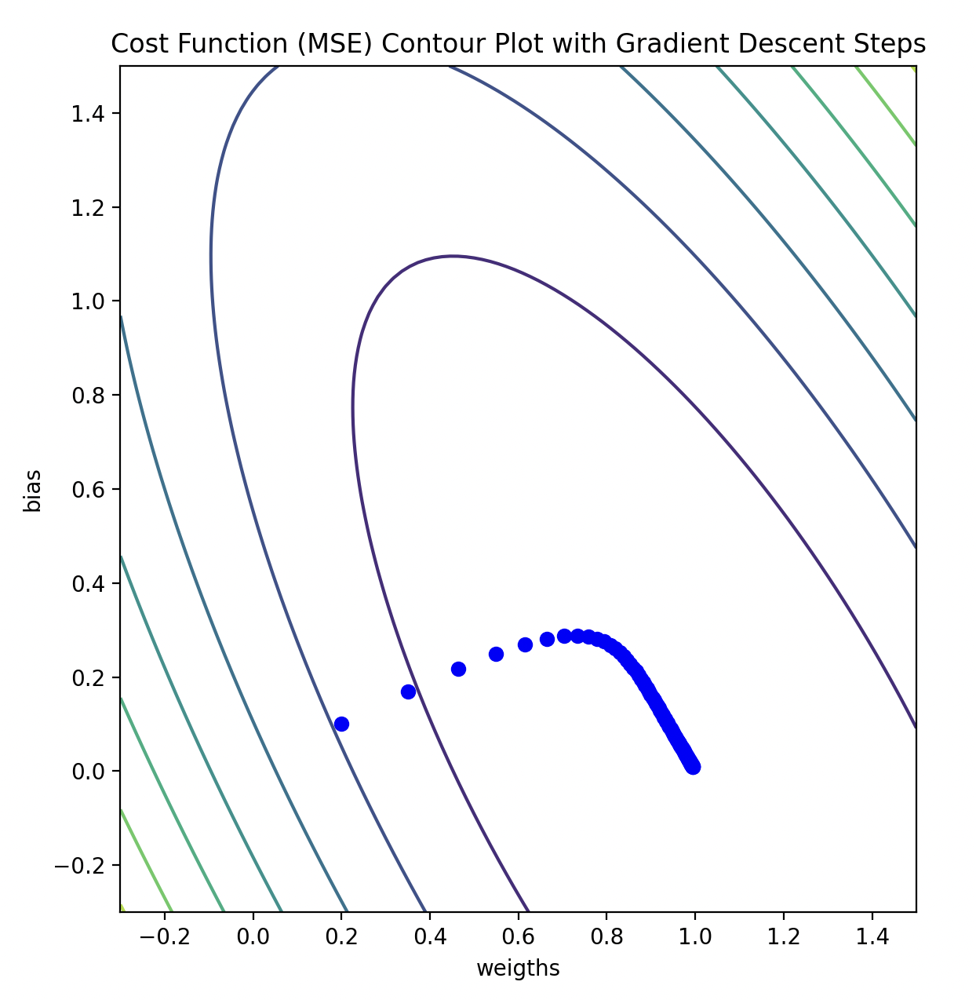

## 1). Create the representation of the simple linear regression by visualize it as a graph and a cost function contour to show the steps of gradient descent.

- เขียนโปรแกรมสำหรับสร้างแบบจำลองเชิงเส้นด้วยวิธีลดตามความชัน พร้อมทั้งแสดงฟังก์ชันค่าใช้จ่ายในรูปของคอนทัวร์และแสดงให้เห็นถึงขั้นตอนในการปรับพารามิเตอร์ (Lecture หน้าที่ 49)

> "Note" we're gonna use metrix for calculation instead of loop. And the full code is written as a Class.

### Sample Data (โจทย์กำหนด)

```python
X = np.array([[0], [2]])
y = np.array([0, 2])
```


</br>

### Let's start! 🚀

</br>

## <mark>Step 1 (Representation)</mark>

From the dataset, we have just 1 feature that means our weigth is only one. So we can use the linear regression equation as

```math
h(x) = w_0 + w_1 x_1
```

After that, we can create the prediction formular as a metrix form in python.

```python
# Representation
    def prediction(self, X):
        # y = wx + b, in the form of matrix calculation y = (w * X) + b
        return np.dot(X, self.weights) + self.bias
```

</br>

## <mark>Step 2 (Evaluation + Optimization)</mark>

But now if we use this immediately with weigth equals to 0 and bias equals to 0 (As I have mentioned before, the initailize of them are 0). The linear line would be the horizontal line like this. And the MSE would be so high as the error value.


</br>

So now we have to optimize it to make it fit to the sample data. We can implement that by python.

```python
def gradientDescent(n_samples, lr, X, y, y_pred):
    d_weigths = (1 / n_samples) * np.dot(X.T, (y_pred - y)) # d_weights = 1 / n * ∑(y_prediction - y_actual) *  X
    d_bias = (1 / n_samples) * np.sum(y_pred - y)           # d_bias = 1 / n * ∑(y_prediction - y_actual)

    weights_gradient = lr * d_weigths
    bias_gradient = lr * d_bias

    return weights_gradient, bias_gradient
```

```python
# Evaluation + Optimization
def training(self, X, y):
    n_samples, n_features = X.shape     # in the shape of n x m, which means n is number of samples and m means number of features
    self.n_samples = n_samples          # set default number of samples
    self.weights = np.zeros(n_features)
    # wights will be zero for all feature at the first time and the size of array depends on the total of features

    for _ in range(self.n_iters):
        y_pred = self.prediction(X)
        weights_gradient, bias_gradient = gradientDescent(n_samples, self.lr, X, y, y_pred)
        self.weights -= weights_gradient
        self.bias -= bias_gradient
        self.weights_history.append(self.weights[0])
        self.bias_history.append(self.bias)
```

The point of this step is to update the new weigth and bias for fitting the data as well as possible. From that we can define the learning rate to tell the model "how fast you want me to go downhills (go to the minimum of error)".

> Warning 🚨 : if we set learning rate to low, the model takes a lot of time to fit the data and wants more iteration. On the other hand, if we set it to high the model would jump across the minimum and hard to fit the model.


</br>

</br>

## <mark>Step 3</mark>

Finally 🎉, after we've done about optimization. We can test our model to see **_"Does it fit the data?"_**.

```python
import numpy as np
import matplotlib.pyplot as plt
from model.LinearRegression import LinearRegression
from plotter.contour import Plot_optimizationAndContour

X_data = [[0], [2]] # X represents to be a row (samples)
y_data = [0, 2] # Y represents to be a column (output)
X = np.array(X_data)
y = np.array(y_data)

linear = LinearRegression(lr=0.1, n_iters=100)
# start by learning rate sets to be 0.1 with number of 100 iterations (less data => high lr)
linear.training(X, y)                          # optimize by using gradient descent
predictions = linear.prediction(X)             # get the prediction output after optimization

plt.figure(figsize=(15,7))
plt.subplot(1, 2, 1)
plt.scatter(X[:, 0], y, color = "b", marker = "o", s = 30)
plt.plot(X, predictions, color='black', linewidth=2, label='Prediction')
plt.xlabel('X')
plt.ylabel('Y')
plt.title('Representation After Optimization')
plt.show()

```

</br>

## <mark>Result</mark> 🎯

> Linear Regression Representation


</br>

> Error Reduction from each iteration


</br>

</br>

## <mark>Addition Step</mark>

You may be wondering **_"Could we visualize the gradient descent steps?"_**. I'd say YES! because in the step of updateing weigths and bias. We have collected the history data of them in arrays. So we can use them to make a cost function contour to visualize it.

We can implement it in python like..

```python
def costFunction(n_samples, y_pred, y):     # Mean Sqaure Error (MSE)
    return (1 / (2 * n_samples)) * np.sum((y_pred - y)**2)

def generate_costs_forContour(self, X, y, w_range, b_range):
    W, B = np.meshgrid(w_range, b_range)
    costs_history = np.zeros(W.shape)

    for i in range(len(w_range)):
        for j in range(len(b_range)):
            weights = w_range[i]
            bias = b_range[j]
            y_pred = weights * X[:, 0] + bias
            costs_history[j, i] = costFunction(self.n_samples, y_pred, y)

    return W, B, costs_history

def get_Weigths_Bias_History(self):
    return self.weights_history, self.bias_history
```

And we can use it like...

```python
import numpy as np
import matplotlib.pyplot as plt
from model.LinearRegression import LinearRegression
from plotter.contour import Plot_optimizationAndContour

X_data = [[0], [2]] # X represents to be a row (samples)
y_data = [0, 2] # Y represents to be a column (output)
X = np.array(X_data)
y = np.array(y_data)

linear = LinearRegression(lr=0.1, n_iters=100) # start by learning rate sets to be 0.1 with number of 100 iterations (less data => high lr)
linear.training(X, y)                          # optimize by using gradient descent
predictions = linear.prediction(X)             # get the prediction output after optimization
w_history, b_history = linear.get_Weigths_Bias_History() # get the value history for visualizing with contour

# mock the weigths (wi) and bias (w0) up from w_history and b_history to draw the contour
weigths_range = np.linspace(-0.3, 1.5, 100)
bias_range = np.linspace(-0.3, 1.5, 100)

# and pass them to calculate the costs
W, B, cost_history = linear.generate_costs_forContour(X, y, weigths_range, bias_range)

# finally, plot them for the visualization
Plot_optimizationAndContour(predictions, X, y, w_history, b_history, W, B, cost_history)
```

</br>

## <mark>Addition Step (Result)</mark> 🕺


</br>

As you can see the error is increasing to the minimum (ideal) each step of the weigths have been updated.

##
